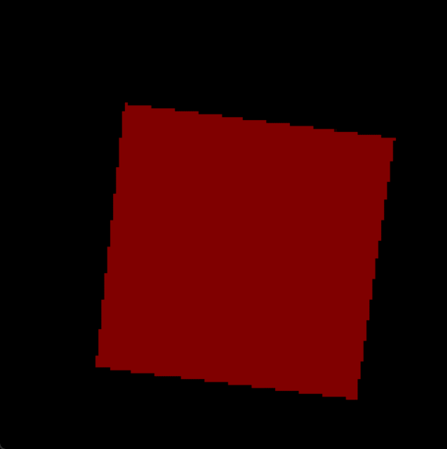
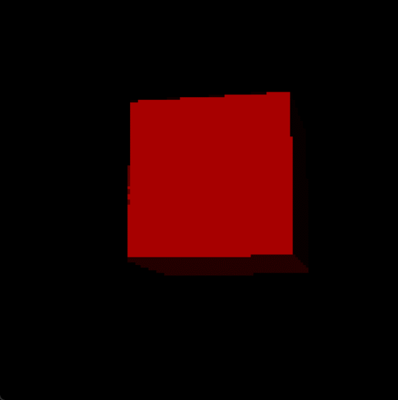

# Spinning Cube Renderer

Welcome to the Spinning Cube Renderer project! This project showcases a realistic spinning cube with dynamic lighting and interactive controls.

## Features

- Realistic light reflection model based on physics.
- Continuous rotation of the cube.
- Engaging visual depth: The cube dynamically approaches the viewer, creating an immersive experience, and then gracefully recedes, all while maintaining its constant rotation.
- Interactive controls:
  - Left-click to pause/resume the cube's rotation.
  - Right-click and drag to manually rotate the cube.

## Screenshots

Check out the dynamic Spinning Cube Renderer in action:

*Spinning Cube Demo: Witness the cube in continuous motion with realistic lighting.*

*Manual Cube Rotation: Experience interactive control as you click and drag to manually rotate the cube.*